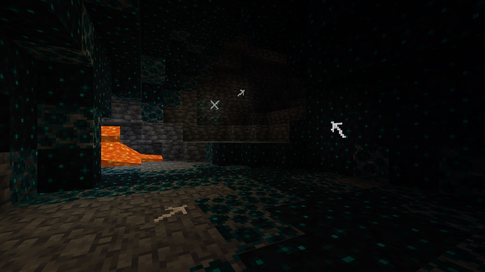

# Chalk (Fabric/Quilt)  
Download from [Curseforge](https://www.curseforge.com/minecraft/mc-mods/chalk-fabric) or [Modrinth](https://modrinth.com/mod/chalk).  
Looking for the Forge version? [Click Here](https://modrinth.com/mod/chalk-mod).  

Fabric/Quilt Loader port of the Minecraft mod [Chalk](https://github.com/mortuusars/Chalk) by mortuusars with some additions and 1.17+ adjustments.  

**Adds two simple types of chalk to aid you on your mining journeys. Never lose your way again.**

Thank you very much for creating the original Forge version and the permission to port Chalk to fabric!  

## Requires  
This branch targets Minecraft 26.3 with Java 25 and Fabric Loader 0.19.5 or newer.
- [Fabric API](https://modrinth.com/mod/fabric-api) for Minecraft 26.3
- [Cloth Config](https://modrinth.com/mod/cloth-config) 26.3.159 or newer for Minecraft 26.3
- Optional: [Mod Menu](https://modrinth.com/mod/modmenu) for the in-game configuration screen

Build with Java 25: `./gradlew build`. See [qa/README.md](qa/README.md) for the
production-JAR server smoke test and its coverage.

## Adds:  
- Chalk: Crafted shapeless with two Calcite  
- Glow Chalk: Crafted shapeless with two Calcite and a Glow Ink Sac  

With chalk, you are able to mark the surface of every full block.  
Hitting the corner of a block creates an arrow pointing in that direction, hitting the center creates an X.  
Marks from Glow Chalk can be seen in total darkness, perfect for caving action!  

## Addons  
[Chalk: Colorful Addon](https://modrinth.com/mod/chalk-colorful-addon) adds variants of chalk in every color!  